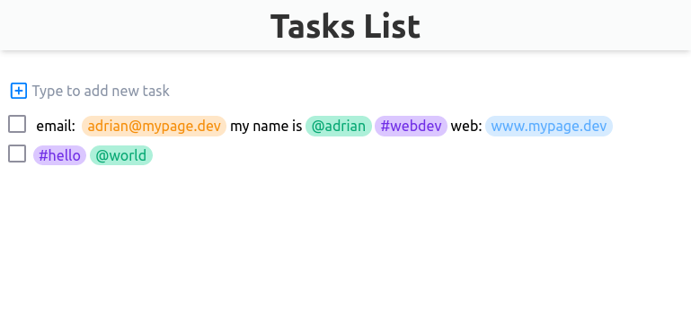

# Technical test - My Task List

This is the Frontend solution to the technical test - My Task List. 

## Table of contents

- [Overview](#overview)
  - [Screenshot](#screenshot)
  - [Links](#links)
- [My process](#my-process)
  - [Built with](#built-with)
- [Author](#author)

## Overview

### Screenshot

### Links

- Solution URL: [https://github.com/adrianburgoscolas/mytasklist](https://github.com/adrianburgoscolas/mytasklist)
- Live Site URL: [https://task-list-xspi.onrender.com/](https://task-list-xspi.onrender.com/)

## My process

### Built with

- Mobile-first workflow
- [React](https://reactjs.org/) - JS library

## Testing
- Run Unit Test and Integration test with `npm run dev`
- Run coverage with `npm run coverage`

## Author

- Website - [Add your name here](https://www.your-site.com)
- Github - [adrianburgoscolas](https://github.com/adrianburgoscolas)
- Twitter - [@AdrianCoder](https://twitter.com/AdrianCoder)
